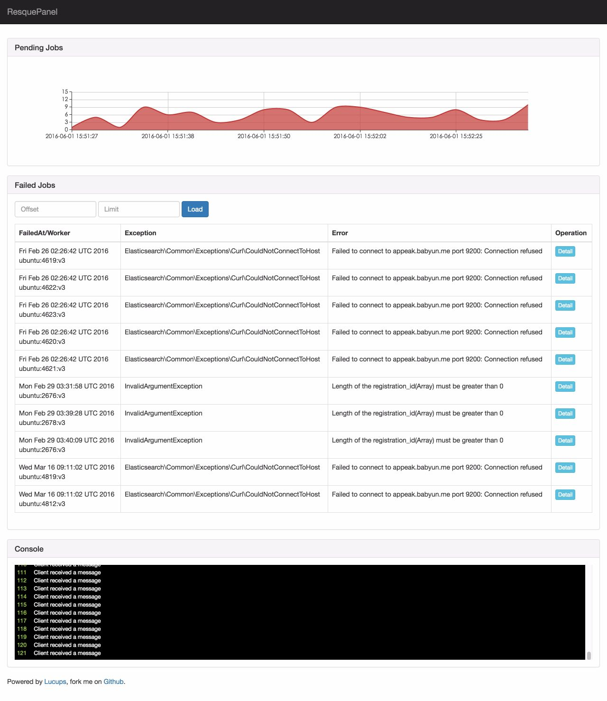
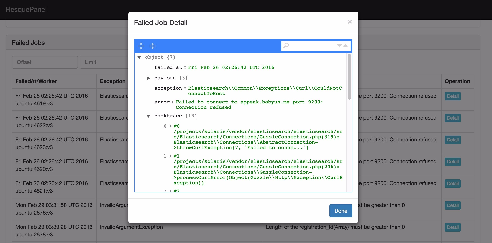

ResquePanel
============

[](https://travis-ci.org/Lucups/resque-panel)

A monitoring tool that contains a web interface for php-resque.


- [中文说明](README_CN.md)

### Install & Configuration

```
# 0. Make sure you have installed swoole and composer

# 1. Clone code from GitHub, and install the libs by composer
git clone https://github.com/Lucups/resque-panel.git
cd resque-panel/
composer install

# 2. Create config file, and edit it
cp ./config/config.dist.php ./config/config.php
vim ./config/config.php

# 3. Start WebSocket server by `nohup` command
nohup php server/resque_panel.php > /tmp/resque_panel.log &

# 4. Start PHP web server (you can also use other web server, just like Nginx or Apache)
php -S localhost:4000 -t web/

# 5. Open your browser, and visit
http://localhost:8080
```

### ScreenShots




### Based Projects List

- [Swoole](#)
- [ECharts](#)
- [jQuery](#)
- [Bootstrap](#)
- [Juicer](#)

### TODO List

- More configuration parameters;
- Refactor service layer;
- Authentication;